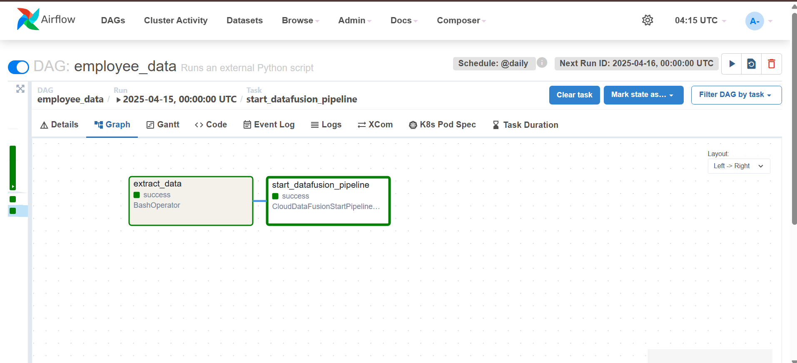
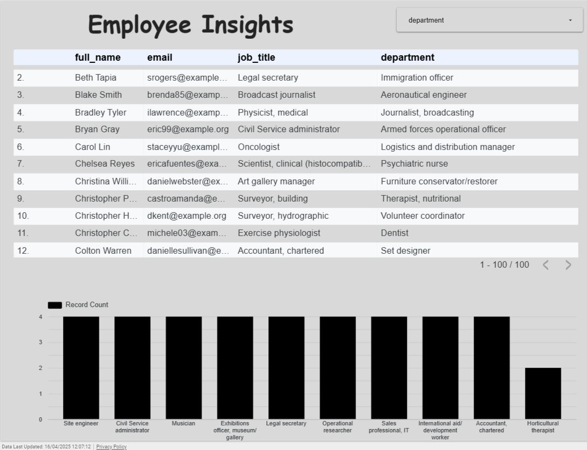

# 👨‍💼 Employee Data Pipeline using Cloud Composer & Data Fusion (GCP)

This project showcases an end-to-end **ETL pipeline** that automates the generation, transformation, and loading of employee data into **Google BigQuery**, leveraging **Apache Airflow via Cloud Composer**, **Cloud Storage**, **Cloud Data Fusion**, and **Python**. The pipeline concludes with an insightful **Looker Studio dashboard** visualizing employee statistics.

---

## 📌 Project Overview

**Objective:** Generate fake employee data, securely transform it using Cloud Data Fusion, and load it into BigQuery for advanced analytics and visualization.

**Technologies Used:**
- 🐍 Python (Data Generation)
- ☁️ Cloud Composer (Workflow Orchestration with Apache Airflow)
- 🗃 Google Cloud Storage (Intermediate Storage Layer)
- 🔄 Cloud Data Fusion (No-code Data Transformation)
- 📊 BigQuery (Enterprise Data Warehouse)
- 📈 Looker Studio (Interactive Dashboards)

---

## 🧱 Architecture

---

## 🔄 Pipeline Steps

### 1. **Generate & Upload Employee Data**
- Script: `extract.py`
- Generates a fake employee dataset using the `Faker` library.
- Fields include: `employee_id`, `first_name`, `last_name`, `email`, `phone`, `salary`, `password`
- The generated CSV (`employee_data.csv`) is uploaded to a GCS bucket via Airflow.

### 2. **Cloud Composer DAG**
- File: `dag.py`
- Orchestrates the pipeline using two main tasks:
  - Run `extract.py` to create and upload the CSV
  - Trigger a Data Fusion pipeline run using an API call
- DAG is scheduled and managed by Cloud Composer (Airflow on GCP)

### 3. **Data Transformation using Data Fusion**
- Input: CSV file from Cloud Storage
- Pipeline Flow:
  - **Source**: Reads `employee_data.csv` from GCS
  - **Wrangler**:
    - Creates a new column `full_name` = `first_name + last_name`
    - Masks the `salary` column
    - Encodes the `password` column (e.g., using base64)
  - **Sink**: Writes transformed data to BigQuery (`employee_dataset.employees`)
- Configuration: Created visually using Data Fusion’s UI

### 4. **Visualization using Looker Studio**
- BigQuery table is connected to Looker Studio
- Dashboard includes:
  - Count of employees by salary range
  - Filter by employee name, domain, or ID
  - Clean UI for insights into the generated dataset
  

---

## 📂 Repository Contents

| File | Description |
|------|-------------|
| `extract.py` | Python script to generate employee data and upload to GCS |
| `dag.py` | Airflow DAG running via Cloud Composer |
| `employee_data.csv` | Sample of generated fake employee data |
| `Dag_pipeline.png` | Visual overview of the Airflow pipeline |
| `Composer_Bucket.png` | Screenshot of the Composer bucket structure |
| `Data_fusion_pipeline.png` | Visual flow of Data Fusion transformation |
| `Looker_studio.png` | Final dashboard preview |
| `desktop.ini` | System file (can be ignored or removed) |

---

## ✅ Conclusion

This project is a complete blueprint of how enterprise-scale data can be programmatically generated, processed securely, and visualized interactively using **modern GCP services**. With **Cloud Composer** managing orchestration and **Cloud Data Fusion** simplifying transformations, the ETL process becomes maintainable, scalable, and auditable.

Whether you're exploring GCP, automating ETL, or just love building pipelines — this project demonstrates a real-world data engineering flow using best practices. 🚀📂📊
